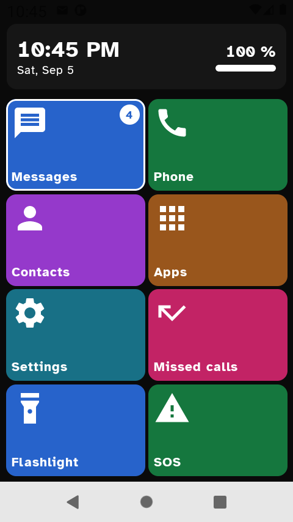
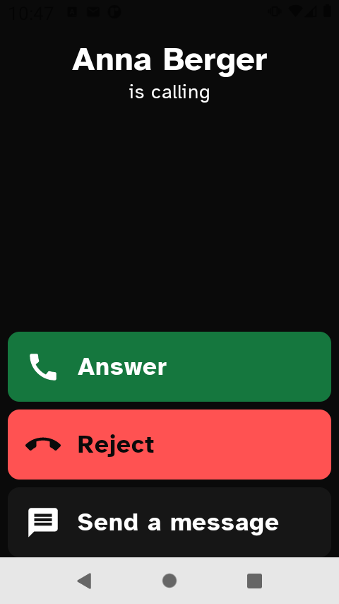
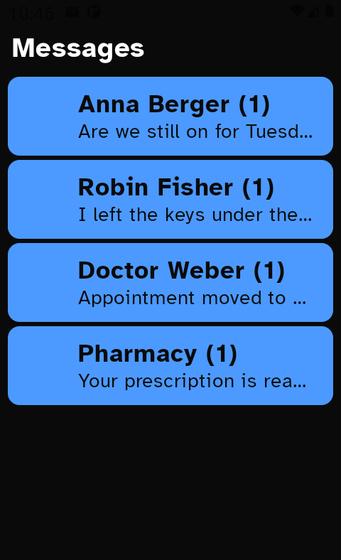
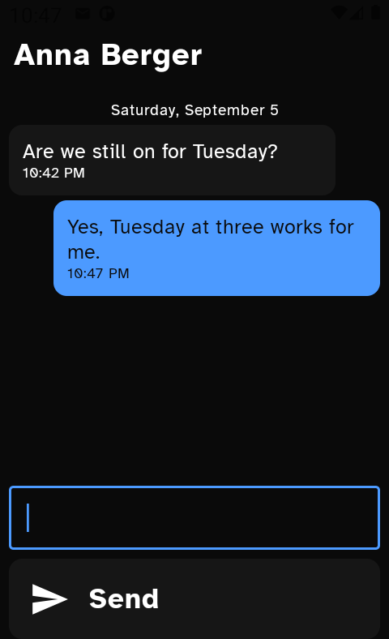
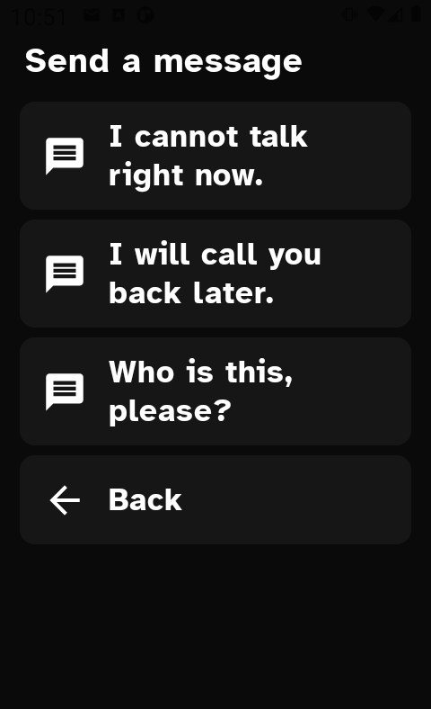
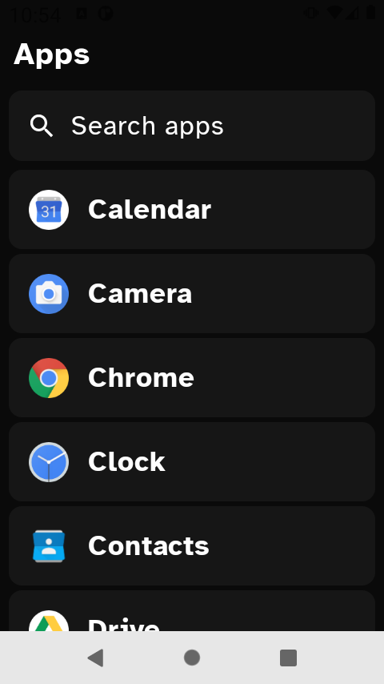
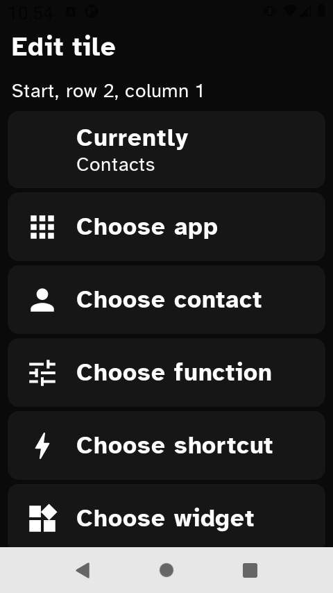
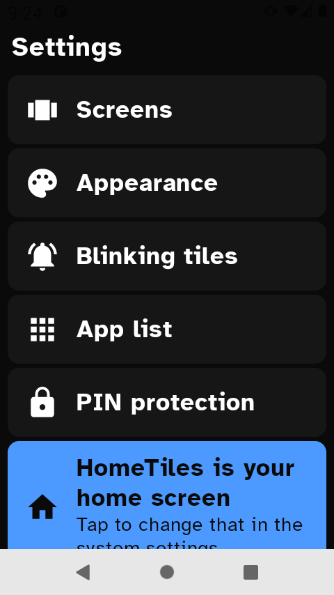
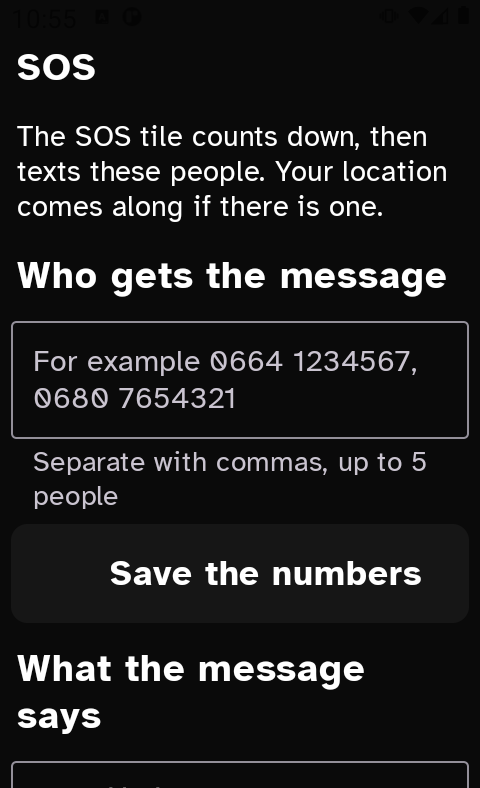

<p align="center">
  
</p>

<p align="center">
  <b>A big, calm home screen for Android. Phone, messages and contacts in the same app.</b>
</p>

<p align="center">
  <a href="https://github.com/timkicker/hometiles/actions/workflows/ci.yml">
    
  </a>
  <a href="LICENSE">
    
  </a>
  
  
  
</p>


## Table of Contents
- [Why HomeTiles?](#why-hometiles)
- [Screenshots](#screenshots)
- [Features](#features)
- [Install](#install)
- [Build](#build)
- [Reproducible builds](#reproducible-builds)
- [Permissions](#permissions)
- [Looks](#looks)
- [Testing](#testing)
- [Contributing](#contributing)
- [License and credits](#license-and-credits)

## Why HomeTiles?

Large-tile launchers exist, but the well known one now spreads phone, messages and the
launcher itself over three paid apps. HomeTiles puts them back in one place, gives the source
away, and asks for no account.

- **3 in one.** Home screen, dialler, messages and contacts ship together and look
  the same.
- **Made for a small screen.** Developed on a **Unihertz Jelly 2**: 3 inches, 480 x 854 px at
  220 dpi, which leaves **349 x 597 dp** once the system bars are off. Big tiles are hardest
  there, and that is the point.
- **No network.** There is no `INTERNET` permission in the manifest, so nothing can leave the
  phone even by accident.
- **No account, no ads, no telemetry.** Your configuration is a file on your phone.
- **Readable by default.** Atkinson Hyperlegible as the standard typeface, tiles that shrink
  their own text before they cut it, and every colour pair at 4.5:1 or better.
- **It does not dial by itself.** Not even the SOS tile: it writes, then offers a button that
  opens the keypad with the number in it.

## Screenshots

<p align="center">
  
  
  
</p>
<p align="center">
  
  
  
</p>
<p align="center">
  
  
  
</p>

## Features

**Home screen**
- A grid of large tiles, each one freely assigned: an app, a contact, a shortcut, a widget, a
  built-in function or a jump to another screen.
- Grid size, tile size, colours, labels and label position are all settings.
- Header with clock, date, battery level and charge bar. It can be switched off.
- Long press reads the tile out or shows its name full screen, for eyes that need it.
- Paging buttons instead of swiping, for hands that do not swipe well.

**Phone**
- Keypad with big keys, speed dial on 2 to 9, call log with grouping.
- Its own call screen: answer, reject, mute, speaker, hold, keypad, bluetooth.
- Turn a call down with a short written answer.
- HomeTiles can take the phone role, but it works without it.
- Emergency numbers always go to the system dialler.

**Messages**
- Thread list, conversation, writing and sending, delivery receipts.
- All four components Android demands of a default SMS app.
- Picture messages already on the phone are shown, text and image.
- Filter by number and by word.

**Contacts**
- Search that ignores accents and case, sorting by first or last name, favourites.

**App list**
- One long list with search and "recently used", and apps can be hidden.
- The last row is always **HomeTiles settings**, so there is a way in even when no tile leads
  there. The search finds that row too.

**SOS**
- A countdown, then a message to up to five people, with the location if there is one.
- After sending, a button opens the keypad with the first number. **HomeTiles never dials by
  itself.**

**Safety net**
- If the launcher fails to start twice in a row, a plain screen appears instead of a black
  phone: the system phone and contacts apps at the top, then try again, settings, choose
  another home screen, and reset the tiles.

**Backup**
- The whole configuration exports to a file and reads back on the next phone.

**Languages**: English, German, Spanish, French, Italian.

## Install

There is **no release yet**. The app runs on Android 8 (API 26) and above; it is developed
against Android 11 on the target device.

Until then, build it yourself (see below). Publication on F-Droid is planned, and the
repository already carries the metadata for it under `fastlane/metadata/`.

## Build

```sh
source ./env.sh          # sets ANDROID_HOME, JAVA_HOME and the gradle path
./gradlew assembleDebug
./gradlew test
./gradlew installDebug
```

You need the Android SDK (compileSdk 35) and a JDK 21. The path to the JDK deliberately does
**not** live in `gradle.properties`; it comes from `JAVA_HOME`.

Modules: `:app` and four libraries, `:core:model` (no Android imports at all), `:core:data`,
`:core:system` and `:core:ui`.

## Reproducible builds

`assembleRelease` produces an **unsigned** APK. Signing it with the debug key would be a lie
about where it came from. Whoever publishes brings their own key; F-Droid signs its own
builds anyway.

Two full rebuilds without the build cache give the same file:

```sh
./gradlew --no-build-cache clean assembleRelease
sha256sum app/build/outputs/apk/release/app-release-unsigned.apk
```

Checked on 10 September 2026 with AGP 8.7.3, Gradle 8.11.1 and JDK 21, built twice without the
build cache, both times

```
16ad97330897df898080ec8b22858eef7c38919fe54a692a75e59f5df6ab364e   1 953 039 bytes
```

for **Commit `ab4951b`**. A checksum belongs to one state of the source, not to the project:
whoever wants to recompute it builds that commit. `tools/rebuild.sh` does both runs and the
comparison in one call.

## Permissions

All of them are optional and are asked for only when the matching feature is used. Without a
SIM or without a granted role the launcher keeps working.

| Permission | What for |
| --- | --- |
| `CALL_PHONE` | calling from speed dial, contacts and SOS |
| `READ_CALL_LOG`, `WRITE_CALL_LOG` | showing and deleting the call log |
| `READ_CONTACTS`, `WRITE_CONTACTS` | contacts and the favourite mark |
| `SEND_SMS`, `READ_SMS`, `RECEIVE_SMS` | messages |
| `READ_PHONE_STATE` | the signal bars |
| `ACCESS_FINE_LOCATION`, `ACCESS_COARSE_LOCATION` | the location in an emergency message |
| `POST_NOTIFICATIONS` | showing a new message and an incoming call |
| `USE_FULL_SCREEN_INTENT` | an incoming call on a sleeping screen |
| `VIBRATE` | feedback on a press |

No `INTERNET`, and no `QUERY_ALL_PACKAGES`: a launcher gets by with `<queries>` and
`LauncherApps`.

Anyone reading the archive will still find `okhttp3/.../publicsuffixes.gz`: the image library
Coil brings an HTTP client that HomeTiles never calls, since contact photos come through
`content://`. R8 removes the code, the 41 kB of data stay. Without the `INTERNET` permission
none of it can reach the network.

## Looks

Dark is the main theme, with a light one, a contrast theme (black on yellow) and the setting
"follow the phone". Every tile is one flat colour, the icon at the top left, the label at the
bottom left inside a zone of fixed height, so the baselines line up even when a label wraps.
All colour pairs meet at least 4.5:1, and a rule checks that for every combination the app is
able to draw.

More in [PLAN.md](PLAN.md), section 3. That file is in German: the plan is written in the
language it was thought in. The running log it refers to stays on the machine it was written
on - it records measurements taken on a real phone, screen contents included, and that is
nobody's business but its owner's.

## Testing

There is no test framework here beyond JUnit, and there are **1546 rules** in 313 classes.
Most of them do not run the app; they read its source and hold it to a promise:

- A permission in the manifest that no code uses is a claim about abilities that do not
  exist, and a rule lists every place that may dial or send.
- Colour pairs are computed, not eyeballed.
- A number in a user-visible sentence must come from the constant it talks about.
- Facts measured on a device carry the date they were measured on.
- Text must fit the smallest screen the app targets, measured rather than assumed.

The rules exist because the app is meant for someone who cannot easily work around a bug.

```sh
./gradlew test
```

## Contributing

Focused pull requests are welcome.

- Kotlin, Compose, and no new dependency without a reason.
- New behaviour comes with a rule that fails without it.
- Comments say what the code cannot: a condition you cannot see, a why-not, or where a number
  came from.

## License and credits

HomeTiles is free software: you can redistribute it and/or modify it under the terms of the
GNU General Public License as published by the Free Software Foundation, either version 3 of
the License, or (at your option) any later version.

HomeTiles is distributed in the hope that it will be useful, but WITHOUT ANY WARRANTY;
without even the implied warranty of MERCHANTABILITY or FITNESS FOR A PARTICULAR PURPOSE.
See the GNU General Public License for more details.

You should have received a copy of the GNU General Public License along with this program.
If not, see <https://www.gnu.org/licenses/>.

- License: [GPL-3.0-or-later](LICENSE)
- Typeface: **Atkinson Hyperlegible** by the Braille Institute of America under the SIL Open
  Font License 1.1, see
  [LICENSE-Atkinson-Hyperlegible.txt](LICENSE-Atkinson-Hyperlegible.txt). It is the default
  because it pulls apart letters that otherwise look alike.

**Libraries**
- [Jetpack Compose](https://developer.android.com/jetpack/compose) - the whole interface
- [Coil](https://coil-kt.github.io/coil/) - contact photos and picture messages
- [kotlinx.serialization](https://github.com/Kotlin/kotlinx.serialization) - the configuration file
- [AndroidX Core, Activity and Lifecycle](https://developer.android.com/jetpack/androidx) - the platform glue
